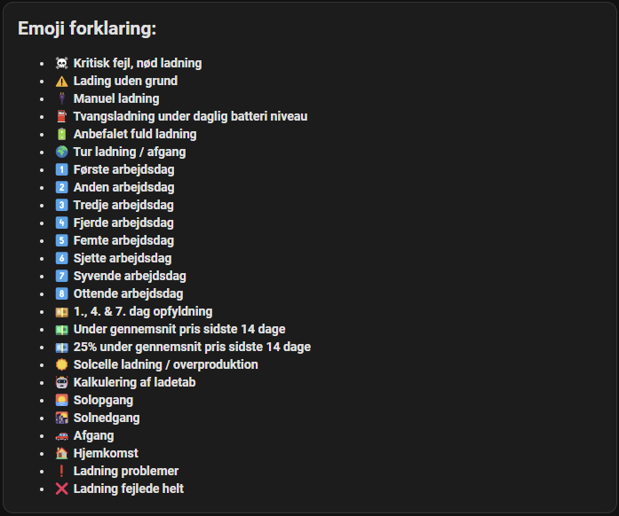
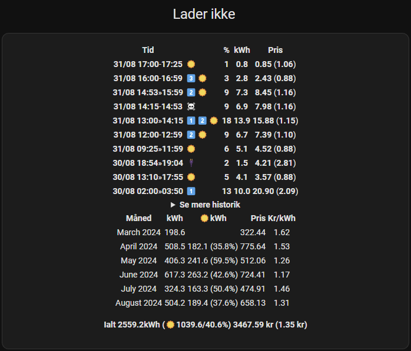
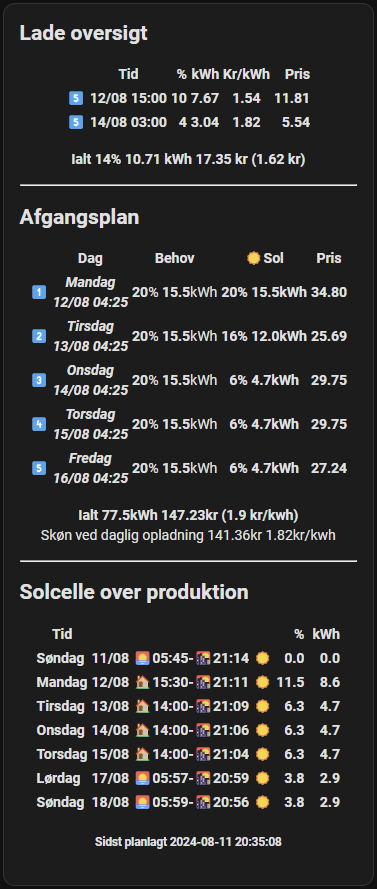
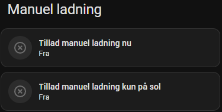

> [!Note]
> ### Tilføj til dette til configuration.yaml for at kunne opdatere fra Home Assistant service
> #### Docker:
> ```yaml
> shell_command:
>   update_cable_juice_planner: "bash /config/scripts/update_cable_juice_planner.sh"
> ```
> 
> #### Home Assistant OS:
> ```yaml
> shell_command:
>   update_cable_juice_planner: "bash /mnt/data/supervisor/homeassistant/scripts/update_cable_juice_planner.sh"
> ```
---
> [!Note]
> ### Lav et script og modtag result i en notifikation
> 1. Indstillinger
> 2. Automatiseringer & Scener
> 3. Scripts
> 4. Tilføj Script
> 5. Opret nyt script
> 6. Klik på ⋮
> 7. Rediger i YAML
> 8. Copy & Paste koden nedenunder
> 9. Gem script
> ```yaml
> alias: Cable Juice Planner Opdatering
> sequence:
>   - service: shell_command.update_cable_juice_planner
>     data: {}
>     response_variable: return_response
>   - if: "{{ return_response['returncode'] == 0 }}"
>     then:
>       - service: persistent_notification.create
>         metadata: {}
>         data:
>           title: Cable Juice Planner Opdatering
>           message: "{{ return_response['stdout'] }}"
>     else:
>       - service: persistent_notification.create
>         metadata: {}
>         data:
>           title: Cable Juice Planner Opdatering ERROR
>           message: "{{ return_response['stderr'] }}"
> description: ""
> icon: mdi:cloud-download
> ```
| Emoji beskrivelse | Historik | Oversigt |
| --- | --- | --- |
|  |  |  |

| Manuel ladning | Tur ladning |
| --- | --- | 
|  |  |

| Indstillinger |
| --- |
|  |
