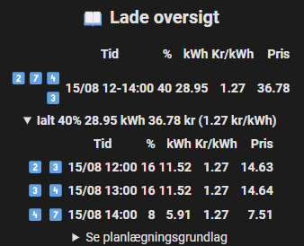

# 🚗Cable Juice Planner🔋🌞📅 til Home Assistant (PyScript)

### Beskrivelse:
Planlægger og styrer opladning af elbil, ud fra en arbejdsplan eller de billigste tider over en uge.

Der understøttes nuværende & fremtidig prognose solcelle overproduktion, via historik og/eller **Solcast PV Forecast** integration

#### Lade regler: ####
- **Solcelleoverskud til opladning**
  - Oplades bilen med solcelle overskudsproduktion, den kan indstilles til at bruge alt strøm i nuværende time også selv, hvis opladningen starter senere i nuværende time, bruger den alt overproduktion fra timen.
  - Kan også indstilles til x antal minutter tilbage, f.eks. 15 min vil den dele timen op i 4 (13:00, 13:15, 13:30 & 13:45) og bruge overkudsproduktion i de intervaller.

- **Arbejdsplan opladning**
  - Specificere nødvendig kilometer per arbejdsdag, afgang, hjemkomst og forvarm valg. Scriptet finder de billigste tider, at lade bilen på og starter/stopper selv ladningen derefter, forvarmer bilen til afgang, hvis valgt

- **Optimal ugeopladning (uden Arbejdsplan)**
  - Specificere man forventer antal kilometer, der køres per dag.<br>Scriptet deler differencen mellem nuværende batteriniveau (f.eks. 27%) og **Elbilens maks anbefalet ladingsprocent** (f.eks. 90%) op i 3 dele (f.eks. 63%/3=21%) og på 1/4/7 dag(e) fra nu af finder de billigste tider at lade bilen på og starter/stopper selv ladningen derefter.


<a href="https://sloth.nu/tesla_solar_demo.gif" target="_blank"></a><a href="https://sloth.nu/virtual_ev_demo.gif" target="_blank"></a>
[]
---

### Funktioner:
- **Lader integration styring**
  - Start/stop ladning
  - Dynamisk ampere begrænsning (til solcelle overproduktion, kun Easee lader indtil videre)
  - (Ved ingen lader integration, skal bilen kunne starte & stoppe ladningen)
- **Elbil integration eller virtuel elbil**<br>*(Elbil i Home Assistant ellers virtuel elbil, hvor man selv indtaster ladeprocent, ved strømtilkobling)*
- **Offentlig opladning registrering (hvis elbil integration konfigureret)**
  - **Guide:**
    1. Automatisk registrering af tidspunkt, start & stop batteriniveau, tilføjet antal procent
    2. Efter endt offentlig opladning gemmes dataen
    3. Hver offentlig opladning indtastes den totale omkostning i **input_number ev_public_charging_session_cost**, efter ca. 1 min tilføjes dataen til historikken *(indtast -1, sletter opladningen)*
    4. Efter tilføjes, nulstilles **input_number ev_public_charging_session_cost** til 0.0 og næste opladning kan indtastes
  - Brug evt. kortet **[public_charging_session_done.yaml](cards/public_charging_session_done.yaml)** fra cards mappen
  - <font color=lightblue>**OBS. hver offentlig opladning indtastes i den rækkefølge der er opladet**</font>
  - <font color=darkorange>**Dataen slettes ved Home Assistant genstart**</font>
    
- **Meget detaljeret opladningshistorik**
  - Hver ladning (Tid, ladegrund, procent, kWh, pris, kr/kWh)
  - Måned oversigt (Måned, Km, kWh, solcelle overproduktion andel, pris, kr/kWh)
  - Ladningsfordeling (Måned, Dag kWh andel, Nat kWh andel)
  - Offentlig opladning (Total, opladningsandel)
- **Solcelle over produktion til rådighed i nuværende time eller X minutter tilbage (tilvalg)**
- **Powerwall understøttelse (tilvalg)**
  - Oplades først til specifik sat batteriniveau
  - Tillad afladning af powerwall ned til sat batteriniveau
  - (Lav en automation til at deaktivere powerwall afladning når bilen lader, med mindre **input_boolean.ev_powerwall_discharge_above_needed** aktiveret & over **input_number.ev_ev_charge_after_powerwall_battery_level**)
- **Estimere husets forbrug udfra intern historik database til brug i planlægning**<br>(Husets forbrug er uden ignorer entiteterne, powerwall ladning, bil ladning)
- **Nuværende strømpris med fratrukket solcelle overproduktion**
- **Oversigter**:
  - **Sidste kørsel effektivitet**<br>
  - **Nuværende batteri niveau udgifter**<br>
  - **Lade oversigt**<br>*(Ladegrund, tid, procent, kWh, kr/kWh, pris)*<br>
  - **Afgangsplan**<br>*(Dag/Dato, procent/kWh behov, solcelle overproduktion andel, pris)*
  - Skøn ved daglig opladning<br>*(Så man kan se forskellen, ved dette script og alternative løsninger f.eks. Clever, Monta, TrueEnergy osv. som lader op til f.eks. 90% inden et klokkeslæt næste dag)*
  - **Solcelle over produktion prognose**<br>
- **Tur planlægning**
  - *Ladning til procent* eller *Tur km forbrug*
  - Forvarmning af elbilen
  - Afgang dato/tidspunkt
  - Hjemkomst dato/tidspunkt
- **Manuel opladning (bruges f.eks. ved gæsteladning)**<br>*(Understøtter også evt. kun på solcelle overproduktion)*
- **Emoji forklaring**
- **Tvangsladning under daglig batteri niveau**<br>*(op til **Daglig hjemkomst batteri niveau** f.eks. 30%)*
- **Udregning af realistisk forbrug**:<br>*(udfra kørselsmønster, forbrug inkl. forvarmning)*
  - **Kørsel effektivitet**
  - **km/kWh & Wh/km**
  - **Estimerede rækkevidde ved nuværende batteri niveau**<br>*(og total rækkevidde)*
- **Refusion af elafgift**
- **Notifikation ved ny version af Cable Juice Planner**
- **Opdaterer Cable Juice Planner via Home Assistant GUI**
- :warning: <mark>Fail-safe regler</mark> :warning:
  - Ved kritisk fejl i scriptet, lades der maks
  - Ved elpriser integration ikke tilgængelig / fejl / data mangel, bruges intern database
  - Ved Solcast PV Forecast ikke tilgængelig / fejl / data mangel, bruges intern database

- ### Indstillinger:
  - **Opladningsregler**:
    - Solcelleoverskud til opladning
    - Arbejdsplan opladning
    - Optimal ugeopladning (uden Arbejdsplan)
    - (Scriptet er deaktiveret når alle opladningsregler er slået fra)
  - **Automatisk fuld opladning, hver X antal dage**<br>*(bruges ved ikke lithium batterier, der skal lades op til 100%, med jævne mellemrum)*
  - **Automatisk opladning ved billig og meget billig strøm**
  - **Batteriniveau- og Forvarmningsindstillinger for Elbil indstillinger**:
    - Daglig hjemkomst batteri niveau efter arbejde (minimum)
    - Tur hjemkomst batteri niveau
    - Elbilens minimum ladingsprocent
    - Elbilens maks anbefalet ladingsprocent
    - Forvarm bilen X min før
  - **Solcelleoverproduktion Salgspris, fastpris eller nuværende salgspris**<br>*(fratrukket udgifter for at sælge det)*
  - **Powerwall-indstillinger**
    - Tillad afladning fra Powerwall
    - Oplad elbil efter Powerwall minimum batteriniveau
  - **Kalkulering af lade tab**

### :warning: <mark>**Home Assistant Standard database, SQLite understøttes ikke**</mark> :warning:
  - Installere f.eks. MariaDB og evt. InfluxDB
    - [Konvertere til MariaDB](https://theprivatesmarthome.com/how-to/use-mariadb-instead-of-sqlite-db-in-home-assistant/)
    - [Installere InfluxDB](https://pimylifeup.com/home-assistant-influxdb/)
    - [Optimimere Home Assistant Database](https://smarthomescene.com/guides/optimize-your-home-assistant-database/)
  - pga. fejl i homeassistant.components.recorder.history bibliotek
### Påkrævet integrationer
- [HACS](https://github.com/hacs/integration)
- [PyScript](https://github.com/custom-components/pyscript)
  - Allow All Imports - Aktiveret
  - Access hass as a global variable - Aktiveret
- [Energi Data Service](https://github.com/MTrab/energidataservice)
  - [Carnot](https://www.carnot.dk/) - Aktiveret (AI elpriser prognose)
- [Sun](https://www.home-assistant.io/integrations/sun/)
- Vejr prognose integration
  - [AccuWeather](https://www.home-assistant.io/integrations/accuweather/)
  - [Meteorologisk institutt](https://www.home-assistant.io/integrations/met/)
  - [OpenWeather](https://www.home-assistant.io/integrations/openweathermap/)
  - Andre med temperatur, skydække og som understøtter weather.get_forecasts service kald

### Understøttet og testet integrationer<br>*(Mulig understøttelse af andre, dog ikke testet)*
- **Lader integrationer:**
  - [Easee Charger](https://github.com/nordicopen/easee_hass)

- **Elbil integrationer:**
  - [Cupra WeConnect](https://github.com/daernsinstantfortress/cupra_we_connect)
  - [Kia UVO](https://github.com/Hyundai-Kia-Connect/kia_uvo) (Forvarmning ikke understøttet endnu)
  - [Polestar API](https://github.com/pypolestar/polestar_api)
  - [Tesla](https://github.com/alandtse/tesla)
  - [TeslaFi](https://github.com/jhansche/ha-teslafi)
  - [Tessie](https://www.home-assistant.io/integrations/tessie/)

- **Inverter integrationer:**
  - [Fronius](https://www.home-assistant.io/integrations/fronius/)
  - [Huawei Solar](https://github.com/wlcrs/huawei_solar)
  - [Kostal](https://www.home-assistant.io/integrations/kostal_plenticore/)
  - [Solarman](https://github.com/StephanJoubert/home_assistant_solarman/)

- **Solcelle produktion prognose**
  - [Solcast PV Forecast](https://github.com/BJReplay/ha-solcast-solar)

### Todo
1. [Zaptec EV charger](https://github.com/custom-components/zaptec) (Mangler test personer)
2. Ladetab kalkulering ved 1 fase & 3 faser ved min & max amps
---
### Fremtiden
- Konvertere scriptet til en integration

---

<center>

#### Det anbefales kraftigt at bruge MariaDB istedet for SQLite (standard home assistant database),<br>(Home Assistant laver en fejl ved kald af historik data med SQLite)

</center>

### Installation:
1. Kopiere koden her under og sæt ind i Terminal eller SSH, Cable Juice Planner installeres og nødvendig ændringer i configuration.yaml tilføjes automatisk
```shell
curl -s https://raw.githubusercontent.com/dezito/Cable-Juice-Planner/master/scripts/update_cable_juice_planner.sh | bash
```

2. Ved første start vil den lave en yaml konfig fil (ev_config.yaml) i roden af Home Assistant mappen
3. Redigere denne efter dit behov
4. Genstart Home Assistant
    - Ved anden start vil den lave en yaml fil i packages mappen (packages\ev.yaml) med alle entities scriptet bruger
      - Dette variere afhængig af om der er integrationer til solceller, el bilen osv. der bliver registreret i konfig filen
      - Alle entitier navne starter med ev_ der laves
5. Genstart Home Assistant
7. Følg [Lav et script til opdatering af Cable Juice Planner](#lav-et-script-og-modtag-resultat-i-en-notifikation)
6. Evt. kopier & sæt ind fra kortene i [Cable-Juice-Planner/cards mappen](cards) mappen
    - Der står i kortene, hvad der evt skal ændres i dem

> [!Note]
>
> Ved flere elbiler køres kommando ```ln -n Cable-Juice-Planner/pyscript/ev.py pyscript/ev2.py``` i Terminal eller SSH, dette laver en ny hardlink til ev.py, den nye prefiks vil være ev2
>
> I "ev2_config.yaml" indsættes entity_id fra "ev_config.yaml", hvis du har solceller og 2 laderer.
>
> ev_config.yaml:
> ```yaml
> charger:
>   entity_ids:
>     power_consumtion_entity_id: >>Denne entity id<< # **Required** Charging power in Watt
> ```
>
> ev2_config.yaml:
> ```yaml
> home:
>   entity_ids:
>     ignore_consumption_from_entity_ids: # List of power sensors to ignore
>     - >>Indsæt her<<
> ```


---
### [Konfiguration eksempler](config_examples)
---

### Filer der laves i roden af Home Assistant mappen:
- **ev_config.yaml** *(Konfigurations filen)*
- **ev_charging_history_db.yaml** *(Opladningshistorik database)*
- **ev_drive_efficiency_db.yaml** *(Kørselseffiktivitet procent database)*
- **ev_km_kwh_efficiency_db.yaml** *(Km/Kwh database)*
- **ev_kwh_avg_prices_db.yaml** *(Offline strøm priser database)*
- **ev_power_values_db.yaml** *(Husforbrug prognose udregning, ved brug af solar.entity_ids.forecast_entity_id i konfigurationen)*
- **ev_solar_production_available_db.yaml** *(Solcelle over produktion database)*
- **ev_error_log** *(Ved kritisk fejl gemmes vigtig data, der kan sendes til mig)*
- **packages/ev.yaml** *(Alle entitetterne)*

---
> [!Note]
> ### Lav et script til opdatering af Cable Juice Planner
> 1. Indstillinger
> 2. Automatiseringer & Scener
> 3. Scripts
> 4. Tilføj Script
> 5. Opret nyt script
> 6. Klik på ⋮
> 7. Rediger i YAML
> 8. Copy & Paste koden nedenunder
> 9. Gem script
> ```yaml
> alias: Cable Juice Planner Opdatering
> sequence:
>   - service: shell_command.update_cable_juice_planner
>     data: {}
>     response_variable: return_response
>   - if: "{{ return_response['returncode'] == 0 }}"
>     then:
>       - service: persistent_notification.create
>         metadata: {}
>         data:
>           title: Cable Juice Planner Opdatering
>           message: "{{ return_response['stdout'] }}"
>     else:
>       - service: persistent_notification.create
>         metadata: {}
>         data:
>           title: Cable Juice Planner Opdatering ERROR
>           message: "{{ return_response['stderr'] }}"
> description: ""
> icon: mdi:cloud-download
> ```

---
> [!Note]
> ### Dette tilføjes automatisk til configuration.yaml
> #### Docker:
> ```yaml
>homeassistant:
>  packages: !include_dir_named packages/
>
> shell_command:
>   update_cable_juice_planner: "bash /config/Cable-Juice-Planner/scripts/update_cable_juice_planner.sh"
> ```
>
> #### Home Assistant OS:
> ```yaml
>homeassistant:
>  packages: !include_dir_named packages/
>
> shell_command:
>   update_cable_juice_planner: "bash /mnt/data/supervisor/homeassistant/Cable-Juice-Planner/scripts/update_cable_juice_planner.sh"
> ```

> [!Note]
> Klik på et billede nedenunder for at få Home Assistant kortet
> | Emoji beskrivelse | Historik | Oversigt |
> | --- | --- | --- |
> | [](cards/emoji_description.yaml) | [](cards/history.yaml)<br>[Virtuel batteriniveau entity](cards/history_emulated_battery.yaml) | [](cards/overview.yaml) |
>
> | Uge strømpriser | Solcelleoverproduktion |
> | --- | --- |
> | [](cards/week_prices.yaml) | [](cards/solar_price_graf.yaml) |
>
> | Manuel ladning | Tur ladning |
> | --- | --- |
> | [](cards/manual.yaml) | [](cards/trip.yaml) |
>
> | Indstillinger |  |
> | --- | --- |
> | [](cards/settings_solar_charging.yaml) | [](Readme/cards/settings_fully_charged.yaml) |
> | [](cards/settings_fill_up.yaml) | [](cards/settings_cheap_charging.yaml) |
> | [](cards/settings_workplan.yaml) | [](Readme/cards/settings_battery_level_preheat.yaml) |
> | [](cards/settings_solar_sell_price.yaml) | [](cards/settings_calculate_loss.yaml) |
> | [](cards/settings_emulated_ev_settings.yaml) |  |


