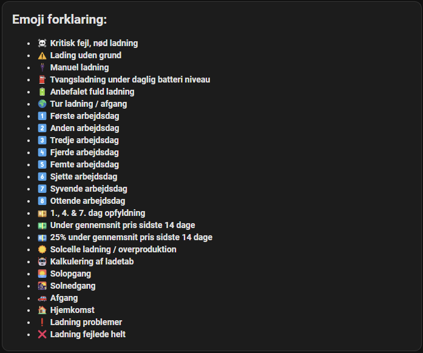
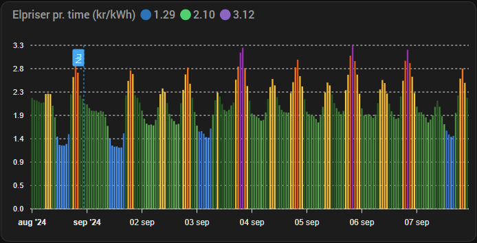
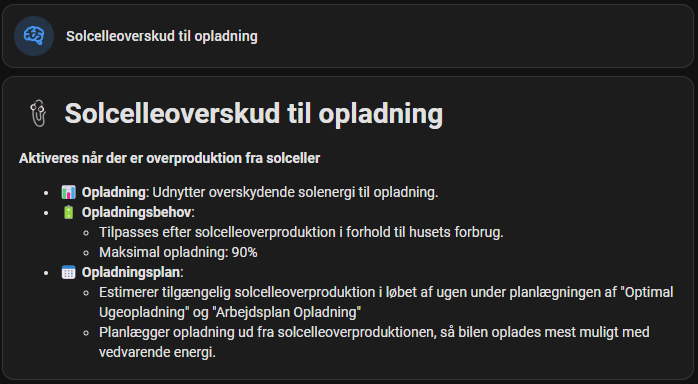
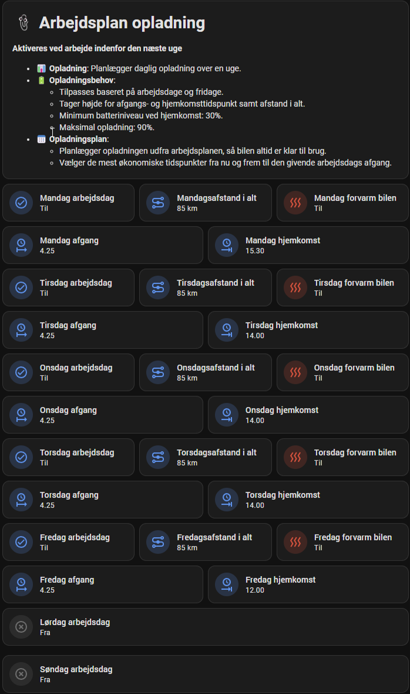

> [!Note]
> Klik på et billede nedenunder for at få Home Assistant kortet
> | Emoji beskrivelse | Historik | Oversigt |
> | --- | --- | --- |
> |  |  [Virtuel batteriniveau entity](../cards/history_emulated_battery.yaml) |  |
>
> | Uge strømpriser | Solcelleoverproduktion |
> | --- | --- |
> |  |  |
>
> | Manuel ladning | Tur ladning |
> | --- | --- |
> |  |  |
>
> | Indstillinger |  |
> | --- | --- |
> |  |  |
> |  |  |
> |  |  |
> |  |  |